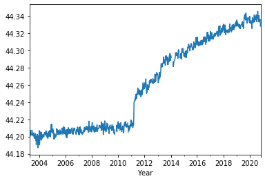
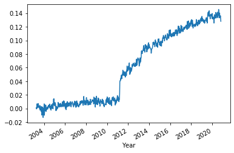
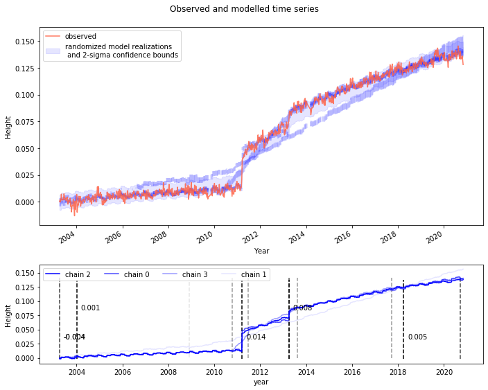

# Quick Start

-----
<a id='top'></a>

## discotimes

<div style="height:10px;"></div>

- [// Why discotimes?](#why)
- [// Setting up the data/model](#setup)
- [// Running the model](#running)
- [// Plotting and Visualization](#plotting-and-visualization)
- [// Model output](#output)
- [// Command line interface - Fitting multiple files](#cli)
- [// References](#References)

-----

<a id='why'></a>
### Why discotimes?

Discotimes is a tool to estimate DISCOntinuities in TIME Series. It is particularly designed for geophyiscal time series, i.e., long (~years to decadal) observations from GPS and 'satellite altimetry minus tide gauge' data, but can be applied to any kind of data with similar features.
It estimates the following components:

* base trend
* base offset
* change points
* change point positions
* discontinuities
* incremental trend changes
* multiyear monthly-mean annual cycle
* Noise properties of residuals (currently only AR1)

#### Model definition

The trends g(t) and offsets o(t) are therefore time dependent components of the model:

\begin{equation}
y(t) = o(t) + g(t) + seas  + \eta  \label{eq:02}
\end{equation}

#### Model fitting

The model parameter are simultaneously estimated within a Bayesian Framework. The model implementation, the distribution setups and the sampling algorithms are all based on PyMC3, an extensive python-library to setup Bayesian models (see https://docs.pymc.io/). More information on the exact implementation is given in the paper.

[back to top ](#top)

-----
### Setting up the data/model
<a id='setup'></a>

This section describes the model usage in a python IDE. Please go to section [Command line interface - Fitting multiple files](#cli) for the CLI implementation.

To set up the model import the discotimes class and the standard model settings and have a look into the model settings.


```python
from discotimes.discotimes import discotimes as dt
from discotimes.model_settings import set_settings
settings = set_settings()
settings
```


    {'model_settings': {'n_changepoints': 5,
      'offsets_std': 20.0,
      'model': None,
      'name': '',
      'change_trend': True,
      'change_offsets': True,
      'n_samples': 8000,
      'trend_inc_sigma': 1.0,
      'post_seismic': False,
      'estimate_offset_sigma': True,
      'estimate_trend_inc_sigma': True,
      'annual_cycle': True,
      'AR1': True,
      'p_': 0.1,
      'initial_values': {}},
     'run_settings': {'n_samples': 8000,
      'tune': 2000,
      'cores': 8,
      'nuts': {'target_accept': 0.9},
      'return_inferencedata': True,
      'compress': True},
     'initial_run_settings': {'detection_threshold': 15,
      'detection_resolution': 4,
      'method': 'diff'}}


The dictionary contains information required for the priors ('model_settings'), the sampling ('run_settings'), as well as some information for a pre-fit discontinuity detection ('initial_run_settings'). 


#### model settings
You can change the model settings to meet your requirements: If you don't want to allow for trend changes (but still for discontinuities) set 'change_trend' to False. Change 'n_changepoints' for a different number of maximum allowed change points, or set the assumption initial probability of change points to occurr to 30% (p_ = 0.3). Please run info() for a full explanation of the parameter.

#### run settings
Control the number of cores ('cores') used or the number of sampling iterations ('n_samples'). You can also control settings of the NUTS sampler (https://docs.pymc.io/api/inference.html)

#### Data input
Now load some data. We use a GNSS height time series, which is can be downloaded from the repository in discotimes/examples/G103.txt. Note that we use file_reader, which can handle different types of input data like .tenv3, .txyz2, .txt, .csv and netcdf. Data in .txt or .csv files should have a variable column named 'Height', and a date column ('Year'), specifying the date like 2000.2342.


```python
from discotimes.discotimes import file_reader 
file = 'discotimes/examples/G103.txt'
series = file_reader(file,variable='auto',resample='W')
series.plot()
```


    <matplotlib.axes._subplots.AxesSubplot at 0x7fd2a9846860>





#### Model setup
Now setup the model and name it!


```python
from discotimes.discotimes import file_reader 
from discotimes.discotimes import discotimes as dt
from discotimes.model_settings import set_settings
settings = set_settings()
file = 'discotimes/examples/G103.txt'
series = file_reader(file,variable='auto',resample='W')
```


```python
series
```


    Year
    2003-04-06    44.200050
    2003-04-13    44.201966
    2003-04-20    44.199864
    2003-04-27    44.201558
    2003-05-04    44.207151
                    ...    
    2020-10-04    44.334253
    2020-10-11    44.334183
    2020-10-18    44.336156
    2020-10-25    44.332631
    2020-11-01    44.328080
    Freq: W-SUN, Name: Height, Length: 918, dtype: float64


```python
dt_model = dt(series,settings=settings,name='G103')
```

    Normalize data
    Frequency: W
    first:  2003-04-06 00:00:00  last:  2020-11-01 00:00:00


The normalized data can be assessed with


```python
dt_model.obs.series_clean.plot()
```


    <matplotlib.axes._subplots.AxesSubplot at 0x7fc311363710>





[back to top ](#top)

-----
### Running the model
<a id='running'></a>

Now run the model! Here we set only 4 chains and 2000 iterations.


```python
settings['run_settings']['n_samples']=2000
settings['run_settings']['cores']=4
dt_model.run(**settings['run_settings'])
```

    Multiprocess sampling (4 chains in 4 jobs)
    CompoundStep
    >NUTS: [beta, m_coeffs, trend_inc, trend_inc_sigma_est, positions, mu_pos, offsets, offset_sigma, sigma, trend, offset]
    >BinaryGibbsMetropolis: [act_number]


<div>
    <style>
        /* Turns off some styling */
        progress {
            /* gets rid of default border in Firefox and Opera. */
            border: none;
            /* Needs to be in here for Safari polyfill so background images work as expected. */
            background-size: auto;
        }
        .progress-bar-interrupted, .progress-bar-interrupted::-webkit-progress-bar {
            background: #F44336;
        }
    </style>
  <progress value='16000' class='' max='16000' style='width:300px; height:20px; vertical-align: middle;'></progress>
  100.00% [16000/16000 29:53<00:00 Sampling 4 chains, 0 divergences]
</div>


    Sampling 4 chains for 2_000 tune and 2_000 draw iterations (8_000 + 8_000 draws total) took 1795 seconds.
    The acceptance probability does not match the target. It is 0.9860648007646505, but should be close to 0.9. Try to increase the number of tuning steps.
    The chain reached the maximum tree depth. Increase max_treedepth, increase target_accept or reparameterize.
    The chain reached the maximum tree depth. Increase max_treedepth, increase target_accept or reparameterize.
    The acceptance probability does not match the target. It is 0.8060834909645324, but should be close to 0.9. Try to increase the number of tuning steps.
    The chain reached the maximum tree depth. Increase max_treedepth, increase target_accept or reparameterize.
    The acceptance probability does not match the target. It is 0.7963204852816973, but should be close to 0.9. Try to increase the number of tuning steps.
    The chain reached the maximum tree depth. Increase max_treedepth, increase target_accept or reparameterize.
    The rhat statistic is larger than 1.4 for some parameters. The sampler did not converge.
    The estimated number of effective samples is smaller than 200 for some parameters.
    /home/oelsmann/.conda/envs/vlad_py37/lib/python3.6/site-packages/arviz/stats/stats.py:151: UserWarning: 
    The scale is now log by default. Use 'scale' argument or 'stats.ic_scale' rcParam if you rely on a specific value.
    A higher log-score (or a lower deviance) indicates a model with better predictive accuracy.
      "\nThe scale is now log by default. Use 'scale' argument or "
    /home/oelsmann/.conda/envs/vlad_py37/lib/python3.6/site-packages/arviz/stats/stats.py:671: UserWarning: Estimated shape parameter of Pareto distribution is greater than 0.7 for one or more samples. You should consider using a more robust model, this is because importance sampling is less likely to work well if the marginal posterior and LOO posterior are very different. This is more likely to happen with a non-robust model and highly influential observations.
      "Estimated shape parameter of Pareto distribution is greater than 0.7 for "
    /home/oelsmann/.conda/envs/vlad_py37/lib/python3.6/site-packages/arviz/stats/stats.py:701: UserWarning: The point-wise LOO is the same with the sum LOO, please double check the Observed RV in your model to make sure it returns element-wise logp.
      "The point-wise LOO is the same with the sum LOO, please double check "


    successfully compressed trace


    <discotimes.discotimes.discotimes at 0x7fc3407961d0>


The trace was compressed after running the model. That means we only retain the mean and the standard-deviation of every parameter, not the full Markov Chain. To keep the full Markov chain use:


```python
# dt_model.run(keep_trace=True,**settings['run_settings'])
```

The un-compressed trace will then be available in dt_model.trace['full_trace']


```python

dt_model.save(save_dir=filed)
```


```python
from discotimes.discotimes import discotimes as dt
filed = 'discotimes/examples/'
dt_model=dt.load(save_dir=filed,name='G103')
#dt_model.chain_stats = dt_model.chain_stats_update
```

[back to top ](#top)

### Plotting and Visualization
<a id='plotting-and-visualization'></a>

Now plot the posterior means of the Markov Chains


```python
dt_model.plot() 
```





As can be seen, the 4 chains behave differently. Chain 2 is here selected as the best possible fit. The selection is based on the lowest loo, as also described in the paper. There are different model selection options as noted in the next section.

[back to top ](#top)

-----
### Model output
<a id='output'></a>


#### Statistics

Check chain_stats to see the loo-scores and other statistics, which are derived with pm.compare() (https://docs.pymc.io/notebooks/model_comparison.html)


```python
dt_model.chain_stats['stats']
```


<div>
<style scoped>
    .dataframe tbody tr th:only-of-type {
        vertical-align: middle;
    }

    .dataframe tbody tr th {
        vertical-align: top;
    }

    .dataframe thead th {
        text-align: right;
    }
</style>
<table border="1" class="dataframe">
  <thead>
    <tr style="text-align: right;">
      <th></th>
      <th>rank</th>
      <th>loo</th>
      <th>p_loo</th>
      <th>d_loo</th>
      <th>weight</th>
      <th>se</th>
      <th>dse</th>
      <th>warning</th>
      <th>loo_scale</th>
      <th>chain_index</th>
      <th>num</th>
    </tr>
  </thead>
  <tbody>
    <tr>
      <th>2</th>
      <td>0</td>
      <td>-968.225</td>
      <td>20.3524</td>
      <td>0</td>
      <td>1</td>
      <td>2.0432e-11</td>
      <td>0</td>
      <td>True</td>
      <td>log</td>
      <td>2</td>
      <td>4</td>
    </tr>
    <tr>
      <th>0</th>
      <td>1</td>
      <td>-1025.86</td>
      <td>31.9382</td>
      <td>57.6297</td>
      <td>9.36954e-26</td>
      <td>1.01023e-11</td>
      <td>0</td>
      <td>True</td>
      <td>log</td>
      <td>0</td>
      <td>3</td>
    </tr>
    <tr>
      <th>3</th>
      <td>2</td>
      <td>-1068.97</td>
      <td>91.4944</td>
      <td>100.745</td>
      <td>1.7654e-44</td>
      <td>2.47054e-12</td>
      <td>0</td>
      <td>True</td>
      <td>log</td>
      <td>3</td>
      <td>4</td>
    </tr>
    <tr>
      <th>1</th>
      <td>3</td>
      <td>-1134.81</td>
      <td>1.63601</td>
      <td>166.584</td>
      <td>4.50485e-73</td>
      <td>1.11098e-11</td>
      <td>0</td>
      <td>False</td>
      <td>log</td>
      <td>1</td>
      <td>2</td>
    </tr>
  </tbody>
</table>
</div>


the last column Num shows the estimated number of change points. The best chain according to loo is in 


```python
dt_model.chain_stats['best_loo']
```


    2


#### Trace
The Trace is an dictionary of arviz.InferenceData objects https://arviz-devs.github.io/arviz/api/generated/arviz.InferenceData.html:


```python
dt_model.trace
```


    {'mean': Inference data with groups:
     	> posterior
     	> log_likelihood
     	> sample_stats,
     'std': Inference data with groups:
     	> posterior
     	> log_likelihood
     	> sample_stats}


Here the data was compressed and stored as mean and std of the full chains. The mean of the parameter posteriors are still referring to the normalized data. That means they have to be rescaled by dt_model.obs.std.


```python
dt_model.trace['mean'].posterior
```


<pre>&lt;xarray.Dataset&gt;
Dimensions:              (act_number_dim_0: 5, annual_dim_0: 893, chain: 4, m_coeffs_dim_0: 12, mu_dim_0: 893, mu_pos_dim_0: 5, mult_dim_0: 5, offsets_dim_0: 5, positions_dim_0: 5, trend_inc_dim_0: 5)
Coordinates:
  * chain                (chain) int64 0 1 2 3
  * act_number_dim_0     (act_number_dim_0) int64 0 1 2 3 4
  * offsets_dim_0        (offsets_dim_0) int64 0 1 2 3 4
  * positions_dim_0      (positions_dim_0) int64 0 1 2 3 4
  * trend_inc_dim_0      (trend_inc_dim_0) int64 0 1 2 3 4
  * m_coeffs_dim_0       (m_coeffs_dim_0) int64 0 1 2 3 4 5 6 7 8 9 10 11
  * mult_dim_0           (mult_dim_0) int64 0 1 2 3 4
  * mu_pos_dim_0         (mu_pos_dim_0) int64 0 1 2 3 4
  * annual_dim_0         (annual_dim_0) int64 0 1 2 3 4 ... 888 889 890 891 892
  * mu_dim_0             (mu_dim_0) int64 0 1 2 3 4 5 ... 888 889 890 891 892
Data variables:
    offset               (chain) float64 0.3555 -0.007578 0.3103 0.1035
    trend                (chain) float64 0.3848 0.7776 -0.8904 0.3417
    act_number           (chain, act_number_dim_0) float64 0.5895 1.0 ... 0.006
    offsets              (chain, offsets_dim_0) float64 -0.522 4.116 ... 0.4718
    positions            (chain, positions_dim_0) float64 17.52 10.03 ... 5.793
    trend_inc            (chain, trend_inc_dim_0) float64 0.8799 ... 0.6054
    m_coeffs             (chain, m_coeffs_dim_0) float64 0.0181 ... 0.3322
    sigma                (chain) float64 0.8019 0.8705 0.7089 0.7665
    offset_sigma         (chain) float64 5.068 1.339 7.431 1.249
    mult                 (chain, mult_dim_0) float64 0.5895 1.0 ... 0.9995 0.006
    mu_pos               (chain, mu_pos_dim_0) float64 4.805 6.049 ... 6.228
    trend_inc_sigma_est  (chain) float64 0.696 0.6343 1.423 2.974
    annual               (chain, annual_dim_0) float64 -0.8173 ... 0.01546
    mu                   (chain, mu_dim_0) float64 -0.4618 -0.4544 ... 30.83
    beta                 (chain) float64 0.4345 0.9482 0.3116 0.5096</pre>


Sampling statistics can be obtained from:


```python
dt_model.trace['mean'].sample_stats
```


<pre>&lt;xarray.Dataset&gt;
Dimensions:             (chain: 4)
Coordinates:
  * chain               (chain) int64 0 1 2 3
Data variables:
    energy_error        (chain) float64 0.002132 -0.0006792 -0.003922 -0.01888
    step_size_bar       (chain) float64 0.0006214 0.000436 0.0009349 0.0007112
    perf_counter_diff   (chain) float64 0.4677 0.4562 0.4554 0.4476
    lp                  (chain) float64 -1.081e+03 -1.192e+03 ... -1.096e+03
    process_time_diff   (chain) float64 0.4677 0.4562 0.4554 0.4476
    max_energy_error    (chain) float64 1.747 2.798 14.73 9.391
    diverging           (chain) float64 0.0 0.0 0.0 0.0
    step_size           (chain) float64 0.0003374 0.0002056 0.0001446 0.0006473
    mean_tree_accept    (chain) float64 0.9861 0.8608 0.8061 0.7963
    tree_size           (chain) float64 1.023e+03 1.023e+03 1.023e+03 1.023e+03
    perf_counter_start  (chain) float64 1.167e+07 1.167e+07 1.167e+07 1.167e+07
    energy              (chain) float64 1.1e+03 1.211e+03 1.051e+03 1.115e+03
    depth               (chain) float64 10.0 10.0 10.0 10.0</pre>


#### Conversion to xr.DataSet
To ease readability of the parameter estimates, you can use following function:


```python
dt_model.to_nc()
```


<pre>&lt;xarray.Dataset&gt;
Dimensions:          (chain: 4, v_dim: 6, x: 1)
Coordinates:
    name             (x) &lt;U4 &#x27;G103&#x27;
  * chain            (chain) int64 0 1 2 3
Dimensions without coordinates: v_dim, x
Data variables:
    trend            (x, chain, v_dim) float64 0.001728 0.008308 ... nan
    trend_err        (x, chain, v_dim) float64 0.0001816 0.0007506 ... nan
    offsets          (x, chain, v_dim) float64 0.001597 0.03629 ... nan
    start_pos        (x, chain, v_dim) float64 1.945e+04 2.236e+04 ... nan
    end_pos          (x, chain, v_dim) float64 2.235e+04 2.31e+04 ... nan
    diff             (x, chain, v_dim) float64 2.898e+03 742.0 ... 1.134e+03 nan
    number_cp        (x, chain) float64 3.0 2.0 4.0 4.0
    best_loo         (x) float64 2.0
    lowest_p_loo     (x) float64 1.0
    avg_best_loo     (x) float64 0.0
    loo              (x, chain) float64 -1.026e+03 -1.135e+03 -968.2 -1.069e+03
    p_loo            (x, chain) float64 31.94 1.636 20.35 91.49
    last_obs         (x) float64 2.587e+04
    first_obs        (x) float64 1.945e+04
    sigma_noise      (x, chain) float64 0.003602 0.00391 0.003184 0.003443
    accepted         (x, chain) float64 0.9861 0.8608 0.8061 0.7963
    geweke_converge  (x, chain) float64 -1.642 -0.3152 1.633 2.854
    diverging        (x, chain) float64 0.0 0.0 0.0 0.0
Attributes:
    n_changepoints:            5
    offsets_std:               20.0
    model:                     None
    name:                      
    change_trend:              True
    change_offsets:            True
    n_samples:                 8000
    trend_inc_sigma:           1.0
    post_seismic:              False
    estimate_offset_sigma:     True
    estimate_trend_inc_sigma:  True
    annual_cycle:              True
    AR1:                       True
    p_:                        0.1
    initial_values:            {}
    model_type:                exp
    info:                      Data created with DiscoTimeS on 2021-03-29</pre>


This returns a xr.DataSet which can be stored as netcdf, with dt_model.to_nc().to_netcdf('save_dir'). Start positions, for example, are here stored as days since 1950-01-01.


```python
%load_ext autoreload
%autoreload 2
```


```python
from discotimes.discotimes import discotimes as dt
filed = 'discotimes/examples/'
dt_model=dt.load(save_dir=filed,name='G103')
#dt_model.chain_stats = dt_model.chain_stats_update
```

[back to top ](#top)

### Command line interface - Fitting multiple files
<a id='cli'></a>


[back to top ](#top)

### References
<a id='References'></a>


[back to top ](#top)
